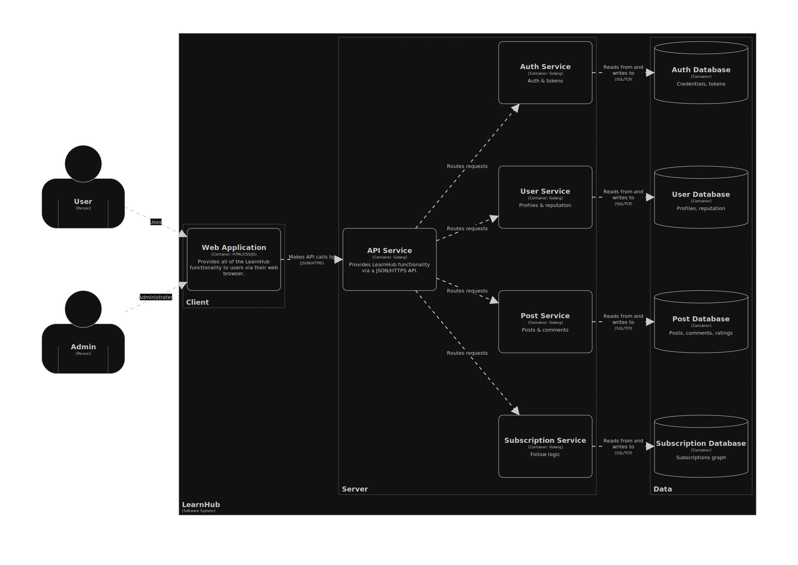

**LearnHub** is a service for sharing educational materials and notes between students, featuring the ability to upload, rate, and comment on materials, filter by subject/course, a reputation system, and copyright protection.

# Architecture
LearnHub is composed of 4 microservices.

| Service | Description | Technology |
|--------|-------------|------------|
| Auth Service | User registration, authentication, token management, email verification | Golang |
| User Service | User profiles, reputation system, ratings and comments | Golang |
| Post Service | Uploading, editing, deleting educational materials and notes | Golang |
| Subscription Service | Follow/unfollow users, subscription logic | Golang |